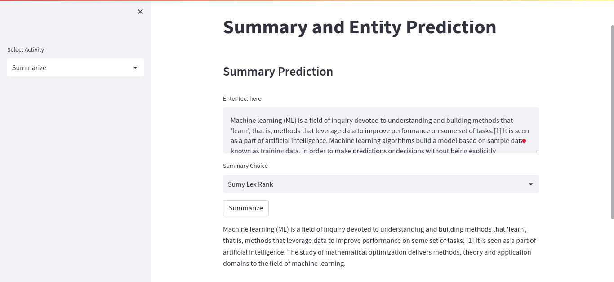
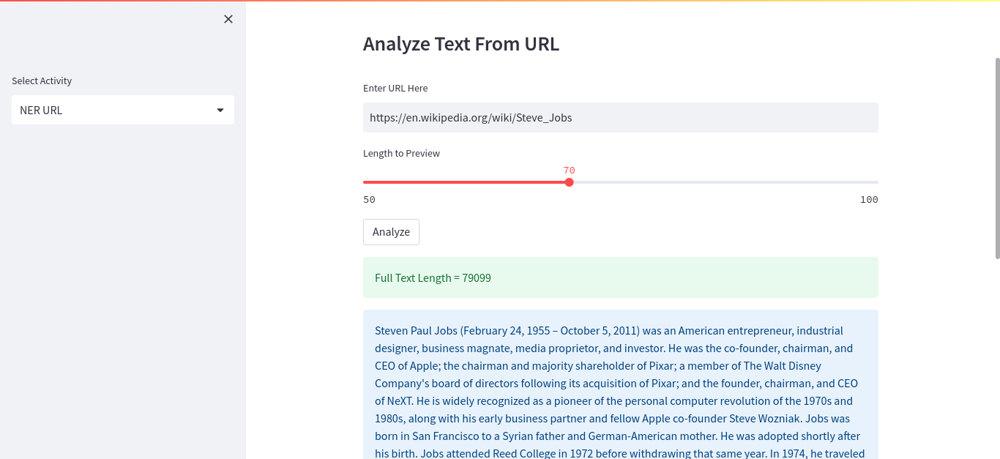

# Summarize Prediction App

This project building a summarization app as well as a named entity checker app using streamlit, spacy,gensim and sumy. This app will consist of three parts.

- Summarizer
- Entity Checker
- Entity Checker of Text Extracted from a URL

## Demo
Check out a live demo and try it for yourself: [demo](https://summarize-prediction-app.streamlit.app/)
## Requirements
```
python 3.7.15
streamlit 1.15.1
gensim 3.6.0
sumy 0.11.0
bs4 0.0.1
spacy 3.4.3
spacy en_core_web_sm 3.4.
etc

```

## Installation

To clone this repository:
```
$ git clone https://github.com/fjrpambudhi74/summarize-prediction.git
```
To install dependencies:
```
$ pip install -r requirements.txt
```

## Screenshots




##
Copyright (c) 2022 Fajar Pambudhi